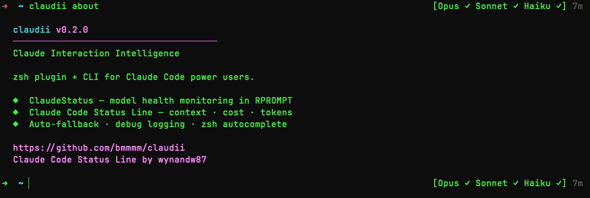

# claudii ♥



Fast Claude Code aliases with live model status and session insights.

## Install

```bash
brew tap bmmmm/tap && brew install claudii
```

Add to `~/.zshrc`:
```bash
source "$(brew --prefix)/opt/claudii/libexec/claudii.plugin.zsh"
```

<details>
<summary>Manual install (without Homebrew)</summary>

```bash
git clone https://github.com/bmmmm/claudii ~/claudii
bash ~/claudii/install.sh
```
</details>

## What you get

**Aliases** — fast access to Claude Code:
```bash
cl                    # Sonnet high
clo                   # Opus high
clm                   # Opus max
clq                   # search mode
clh                   # alias table + live status
```

**ClaudeStatus** — model health right in your prompt:
```
➜  project (main)                        [Opus ↓ Sonnet ✓ Haiku ✓] 3m ⟳
```

**Sessionline** — context, cost, tokens, rate limits inside Claude:
```
Opus ████░░░░░░ 42% │ $0.55 │ 15K↑ 4K↓ │ 5h:23% 7d:71% │ +156 -23 │ 12m
```

## Quick start

```bash
claudii                       # show all commands
claudii status                # live model health
claudii sessionline on        # enable sessionline in Claude Code
man claudii                   # full reference
```

## Requirements

`zsh` · `jq` · `curl`

## License

[GPL-3.0](LICENSE)
