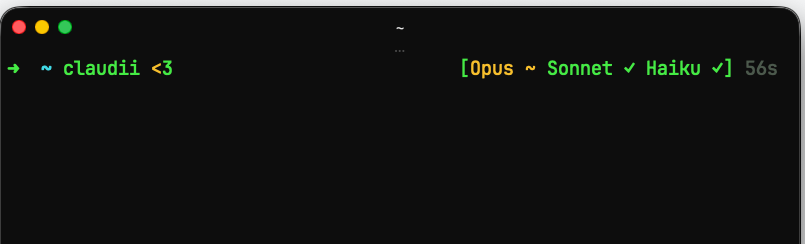
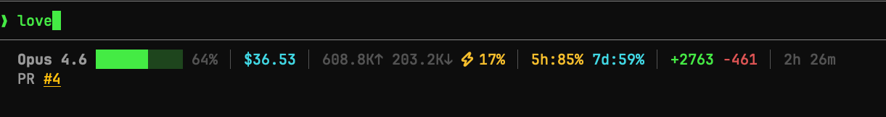

# claudii

**A passive display layer for Claude Code power users.**
claudii shows you what's happening — model health, session costs, context usage, rate limits, cache efficiency.
No agents, no background daemons, no API calls from your prompt. Just reads local cache files.

## Highlights

- **Three display layers** — model health in RPROMPT, multi-session dashboard above your prompt, dense metrics line inside Claude Code
- **Cache-hit ratio** — see how efficiently Claude uses prompt caching (`⚡73%`)
- **Rate-limit intelligence** — 5h/7d usage with reset countdown, auto-fallback to healthy models
- **Cost tracking** — per-session, per-day, per-model breakdown (`claudii cost`, `claudii trends`)
- **Notifications** — get pinged when your rate limit resets (`claudii watch`)
- **Fast aliases** — `cl` (Sonnet), `clo` (Opus), `clm` (Opus max) with effort mode display

## How it works

claudii is read-only. It never modifies your Claude sessions or makes API calls on your behalf.

**Shell prompt (ClaudeStatus + Dashboard):** Reads `~/.cache/claudii/status-models` — a plain text file written by a background subshell that checks `status.claude.com` once every 15 minutes, then exits. No persistent process, no network in `precmd`.

**Inside Claude Code (CC-Statusline):** Claude Code's native `statusLine` hook calls `claudii-sessionline` on each turn and passes session JSON via stdin. The handler writes a cache file and prints one line. Nothing runs between updates.

## Three display layers

### 1. ClaudeStatus — RPROMPT
Model health in your right prompt. Cache-only, never blocks.



`✓` ok · `~` degraded · `↓` down · `?` unreachable · `[…]` loading · `⟳` refreshing

### 2. Dashboard — above your prompt
Appears automatically after each command when Claude sessions are running. One line per active session, minimal:

```
  Opus     73%  $25.63  5h:28% ↺42m
  Sonnet   42%  $1.20
```

Toggle with `claudii dashboard on/off/auto`.

### 3. CC-Statusline — inside Claude Code
Dense metrics on every turn via the `statusLine` hook.



model · effort · context bar · cost · tokens + cache ratio · rate limits · lines changed · duration

## Install

```bash
brew tap bmmmm/tap && brew install claudii
```

Add to `~/.zshrc`:
```bash
source "$(brew --prefix)/opt/claudii/libexec/claudii.plugin.zsh"
```

Enable the CC-Statusline (writes one key to `~/.claude/settings.json`):
```bash
claudii cc-statusline on
# then restart Claude Code
```

<details>
<summary>Manual install (without Homebrew)</summary>

```bash
git clone https://github.com/bmmmm/claudii ~/claudii
bash ~/claudii/install.sh
```
</details>

## Aliases

```bash
cl       # Sonnet, high effort — general default
clo      # Opus, high effort — complex tasks
clm      # Opus, max effort — maximum reasoning
clq      # Sonnet, medium effort — search mode
clh      # alias table + live model health
```

Auto-fallback: if a model is down, claudii picks a healthy one.

## Agent Aliases

Agent aliases launch Claude with a specific skill as the system prompt. Configure in `config.json`, list with `claudii agents`:

```bash
clorch   # Opus high — orchestrate skill
cle      # Sonnet medium — explorer skill
```

```bash
claudii agents                              # list configured agents
claudii config set agents.clorch.skill orchestrate
claudii config set agents.clorch.model opus
claudii config set agents.clorch.effort high
```

## Commands

```bash
claudii                          # smart overview: sessions, account, agents, services
claudii on                       # enable all display layers
claudii off                      # disable all display layers
claudii claudestatus [on|off]    # toggle ClaudeStatus RPROMPT only
claudii dashboard [on|off]       # toggle Dashboard only
claudii cc-statusline [on|off]   # toggle CC-Statusline only
claudii status                   # live model health check     (shortcut: s)
claudii sessions                 # active + recent sessions    (shortcut: ss)
claudii sessions-inactive        # stale sessions              (shortcut: si)
claudii cost                     # per-model cost breakdown    (shortcut: c)
claudii trends                   # weekly/daily cost history   (shortcut: t)
claudii watch                    # notify when rate limit resets
claudii layers                   # component overview
claudii doctor                   # installation health check   (shortcut: d)
claudii config get <key>         # read config value
claudii config set <key> <val>   # write config value
claudii agents                   # list configured agent aliases
```

All commands support `--json` and `--tsv` for scripting. Full reference: `man claudii`

## Config

`~/.config/claudii/config.json` — created from defaults on first run.

| Key | Default | What it does |
|-----|---------|--------------|
| `aliases.cl.model` | `sonnet` | Model for `cl` |
| `aliases.clo.model` | `opus` | Model for `clo` |
| `fallback.enabled` | `true` | Auto-switch on outage |
| `status.cache_ttl` | `900` | Health check interval (seconds) |
| `statusline.models` | `opus,sonnet,haiku` | Models in RPROMPT |
| `dashboard.enabled` | `auto` | Dashboard mode (auto/true/off) |
| `watch.sound` | `` | Path to sound file for notifications |
| `watch.volume` | `50` | Notification sound volume (0-100) |

## Why claudii?

Most Claude Code tools either live *inside* Claude (status bars, themes) or *outside* as reporting dashboards. claudii bridges both — it's the only tool that feeds live session data (cost, context, rate limits, cache efficiency) into your normal shell prompt, so you always know what's going on without switching windows.

It runs entirely on bash + jq. No Python, no Node, no daemons. `zsh` · `jq` · `curl` — that's the full dependency list. Compatible with oh-my-zsh, zinit, and manual source.

## License

[GPL-3.0](LICENSE)
